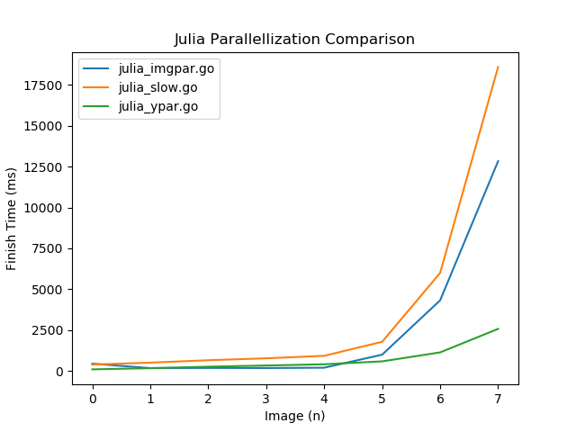

## Task 1 - Matching Behaviour

* What happens if you remove the `go-command` from the `Seek` call in the `main` function?

Since match is buffered, it wont deadlock. As everything's ran in sequence each iteration should alternate between sending and recieving the previous or current name in the list. 

Anna sends, Bob recieves, Cody sends, Dave recieves, Eva sends, no one recieves. 

* What happens if you switch the declaration `wg := new(sync.WaitGroup`) to `var wg sync.WaitGroup` and the parameter `wg *sync.WaitGroup` to `wg sync.WaitGroup`?

I assume the waitgroup is cloned, and at most one Done will be ran which isn't enough to satisfy wg.Wait

* What happens if you remove the buffer on the channel match?

It should deadlock for odd number of people, as the last send will wait for a recive. But for that recieve to happen it needs to have finished the Wait, which it wont since the last subroutine has to finish the send to tell the waitgroup that it's finished. 

* What happens if you remove the default-case from the case-statement in the `main` function?

There's gonna be a deadlock for even number of people. As it then becomes the same as simply writing select{ } 

## Task 2 - Fractal Images

I made two parallellized versions of the julia.go program, highligting what's good/bad parrallelization. Using the [bench.py](../src/bench.py) script it'll benchmark the julia files otput times and make a nice looking graph. 
#### [julia_ypar.go](../src/julia_ypar.go)
unique subroutine for each y pixel of the image.

#### [julia_imgpar.go](../src/julia_imgpar.go)
unique subroutine for each image.

#### [julia_slow.go](../src/julia_slow.go)
unparallellized

## Task 3 - MapReduce

